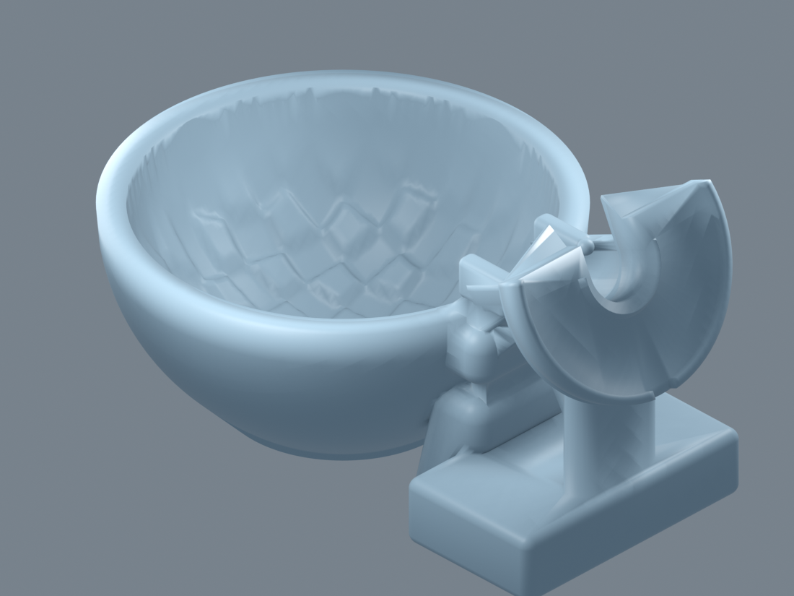

# Compact Travel Shaving Bowl

This is a fresh, open-bowl design built around a seeded mathematical height field. It contains a rounded shaving bowl, an integrated side grip, an angled open razor cradle, a centered enclosed DE-blade compartment, and a separately printable sliding drawer. **There is no lid.**



See the [`renders/`](renders/) gallery for top, side, bottom, texture close-up, section views, and drawer/razor previews, including [`14-head-rest-closeup.png`](renders/14-head-rest-closeup.png) and [`15-name-emboss-closeup.png`](renders/15-name-emboss-closeup.png). Adjustable dimensions and texture controls are listed in [`PARAMETERS.md`](PARAMETERS.md).

## Files

- `travel_shaving_bowl.scad` — parametric source and selectable test/view modes.
- `travel_shaving_bowl.stl` — bowl/body with integrated handle, dock, and empty blade vault; drawer is excluded.
- `blade_drawer.stl` — separate captive sliding drawer with pull tab, passive detent bumps, and end-stop tabs.
- `texture_test_coupon.stl` — 40 × 40 mm terrain and diamond-pattern coupon.
- `razor_dock_test.stl` — cradle and half-round head-shelf samples for 8, 10, 12, and 15 mm handles, spaced 54 mm apart.
- `blade_storage_test.stl` — drawer samples with 1, 3, and 5 dummy blades.
- `handle_strength_test.stl` — grip, attachment pads, blade vault, and dock assembly.
- `emboss_test.stl` — curved exterior-wall patch for checking the raised name before printing the full bowl.
- `fonts/Pacifico-Regular.ttf` and `fonts/OFL.txt` — bundled Pacifico font and SIL Open Font License.
- `renders/` — isometric, orthographic, section, close-up, storage, shelf, and name previews.

## Exporting

Open the project with OpenSCAD 2021.01 or newer. `preview_mode=true` keeps interactive previews lighter. Set it to `false` for the finer production mesh. With Flatpak OpenSCAD:

```sh
flatpak run org.openscad.OpenSCAD -D 'preview_mode=false' -D 'part="bowl"' -o travel_shaving_bowl.stl travel_shaving_bowl.scad
flatpak run org.openscad.OpenSCAD -D 'preview_mode=false' -D 'part="blade_drawer"' -o blade_drawer.stl travel_shaving_bowl.scad
flatpak run org.openscad.OpenSCAD -D 'preview_mode=false' -D 'part="texture_test"' -o texture_test_coupon.stl travel_shaving_bowl.scad
flatpak run org.openscad.OpenSCAD -D 'preview_mode=false' -D 'part="razor_dock_test"' -o razor_dock_test.stl travel_shaving_bowl.scad
flatpak run org.openscad.OpenSCAD -D 'preview_mode=false' -D 'part="blade_storage_test"' -o blade_storage_test.stl travel_shaving_bowl.scad
flatpak run org.openscad.OpenSCAD -D 'preview_mode=false' -D 'part="handle_strength_test"' -o handle_strength_test.stl travel_shaving_bowl.scad
flatpak run org.openscad.OpenSCAD -D 'preview_mode=false' -D 'part="emboss_test"' -o emboss_test.stl travel_shaving_bowl.scad
```

The top-level `part` selector supports `assembly`, `bowl`, `bowl_shell`, `blade_drawer`, `texture_test`, `razor_dock_test`, `blade_storage_test`, `handle_strength_test`, and `emboss_test`. Use `part="assembly"` for inspection only; export the body and drawer separately. `render_mode` supports `top`, `side`, `bottom`, `texture_closeup`, `texture_section`, `handle_section`, `blade_section`, `razor_parked`, and `blades_inside`. For example:

```sh
flatpak run org.openscad.OpenSCAD -D 'render_mode="blade_section"' -o renders/blade-section.png travel_shaving_bowl.scad
flatpak run org.openscad.OpenSCAD -D 'render_mode="blades_inside"' -o renders/blades-inside.png travel_shaving_bowl.scad
```

## Design notes

- The inside and outside bowl profiles are rounded and near-hemispherical, with a stable 45-degree conical base footprint ($r \ge 20$ mm at $z = 0.3$ mm) and a minimum 3.5 mm center floor. Nominal bowl dimensions are `bowl_outer_diameter = 84` mm, `bowl_inner_diameter = 73.7` mm, and `bowl_height = 38.5` mm.
- The lather surface uses an even, staggered 45-degree diamond/drum pattern with softened ridges, shallow broad seeded undulations, and subdued connecting channels. Its outer 5.5 mm fades smoothly into the bowl wall; the relief is limited to about 4.5 mm peak-to-valley rather than deep, uneven craters.
- The razor cradle is open upward, fits the target 8–15 mm handle range, includes rounded retaining bumps and through-drainage ports, and does not drain into blade storage. Handles up to 11.6 mm seat freely; 12-15 mm handles press against the retention bumps. A vertical elevation `dock_raise = 8` mm lifts the entire dock, retention bumps, head shelf, and mount posts above the handle shell. A half-round head shelf supports the assembled razor head, with a U-shaped neck slot, curved-edge retention lip, and drain gap.
- Overhang-safe design (`overhang_safe = true`): implements self-supporting geometry complying with the 45-degree rule ($dz/dr \ge 1.0$), reducing steep overhang area below 2,000 mm² ($1,964.87$ mm² measured). Features include:
  - 45° conical base transition meeting the sphere tangentially, providing a wide $\ge 21.5$ mm bed footprint that eliminates spherical bottom overhangs.
  - Dock support gussets (`gusset_start = 2.0`, `gusset_drop = 12.0`) bracing the cradle and mount posts down to the handle.
  - 45° inverted conical under-plate (`head_rest_lower_plate()`) with a 0.5 mm perimeter inset supporting the head shelf without non-manifold edge artifacts.
  - 45° pitched ceiling on the handle grip cutout and a 54° lower handle junction taper directly to the base.
  - The only overhang $> 500$ mm² is the straight 27 mm drawer vault ceiling bridge at $z \approx 10.7$ mm ($1,286.64$ mm²), which prints cleanly without supports via standard straight bridging.
- Razor head-rest parameters: `head_rest_radius=24`, `head_rest_thickness=3.5`, `head_rest_rim_height=1.6`, `head_rest_rim_width=1.6`, `head_rest_gap=3`, `head_rest_flat_edge=6`, `neck_slot_radius=6.5`, and `head_rest_drain_gap=5` (all dimensions in mm).
- `razor_dock_test.stl` includes the shelf, with its 8, 10, 12, and 15 mm dock samples spaced 54 mm apart.
- Print razor_dock_test with your real razor first; adjust head_rest_gap and neck_slot_radius to your razor's neck.
- A raised two-line name is embossed on the exterior wall opposite the handle. The bundled `fonts/Pacifico-Regular.ttf` is from Google Fonts' Pacifico family and is distributed under the SIL Open Font License in `fonts/OFL.txt`.
- Emboss parameters: `emboss_enabled`, `emboss_line1`, `emboss_line2`, `emboss_bold`, `emboss_font`, `emboss_width1`, `emboss_width2`, `emboss_line_gap`, `emboss_z`, `emboss_height`, `emboss_sink`, and `emboss_max_half_width`.
- To change the font edit `emboss_font`; the bundled Pacifico font is referenced by `use <fonts/Pacifico-Regular.ttf>` in the OpenSCAD source.
- Print the emboss_test patch first. With a 0.4 mm nozzle, keep the letter strokes at 0.8 mm or wider. `emboss_bold = 0.15` bolds the text via a 2D offset after resizing, bringing 98.27% of the line-2 stroke area above 0.8 mm while preserving full text wording.
- The blade vault and drawer are centered across the handle's middle plane, kept below the upper/lower handle attachment pads, and separated from the wet bowl and dock. The shorter vault keeps the drawer and handle balanced while preserving its front pull access. Its independent drawer has adjustable per-side clearance, integral flexible detent tongues and bumps, matching body recesses, stop tabs, and a compact pull tab. Squeeze the stop tabs to remove the drawer deliberately.
- The design targets upright FDM printing with a 0.4 mm nozzle. Inspect the sections and test coupons, then physically validate wall strength, fit, washability, and drawer retention before travel use.

## Mesh verification

The production body, separate drawer, four functional test meshes, and emboss
patch were exported with OpenSCAD. `travel_shaving_bowl.stl` and
`emboss_test.stl` are watertight single-component meshes; the dock test has
four watertight, separated samples. Trimesh reports all exported meshes
watertight. This confirms mesh closure, not real-world print strength, fit, or
waterproofness. Print and physically test before travel use.

## Limitations

The razor and blades shown in preview modes are illustrative solids, not part of the production bowl STL. The model does not guarantee lather performance, razor compatibility beyond the nominal diameter range, waterproofness after printing, or blade safety. Print and test before use.
